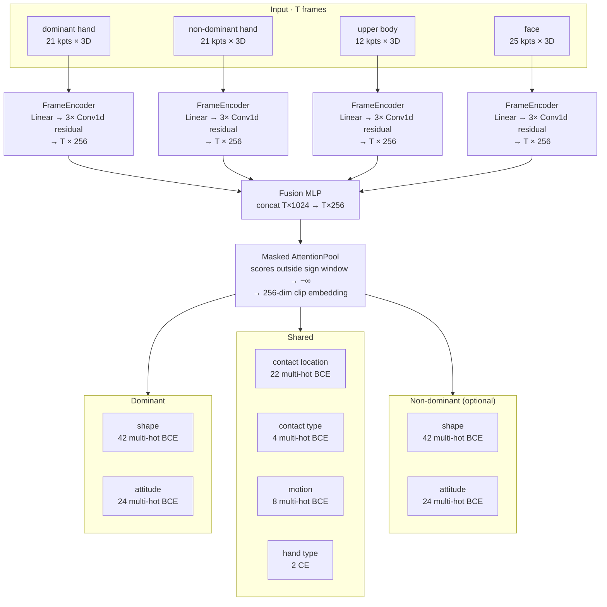

# STS-Net

Phonological property prediction for Swedish Sign Language (STS) from pose keypoints.

**Current version: v0.2** — clip-level attention-pooled model (`ClipClassifier`).
v0.1 and v0.2 are incompatible model families and live in separate trees.
For the v0.1 per-frame BiLSTM model see [v0.1/README.md](v0.1/README.md).

---

## What it predicts

Eight phonological properties, trained from **per-clip labels** and queryable
**per frame** at inference (see [Python API](#python-api)):

| Head | Target | Classes |
|------|--------|---------|
| shape (dom.) | multi-hot BCE | <details><summary>42 handshapes</summary>Flata handen · D-handen · Flata tumhanden · Sprethanden · 4-handen · Vinkelhanden · Tumvinkelhanden · A-handen · S-handen · Klohanden · O-handen · Knutna handen · E-handen · Tumhanden · Pekfingret · L-handen · Raka måtthanden · Nyphanden · Nyphanden (alt) · T-handen · Krokfingret · Måtthanden · Hållhanden · Långfingret · N-handen · Lilla O-handen · Lilla O-handen (alt) · V-handen · Tupphanden · K-handen · Dubbelkroken · Böjda tupphanden · M-handen · W-handen · Lillfingret · U-handen · Flyghanden · Stora långfingret · Runda långfingret · Stora nyphanden · Stora hållhanden · X-handen</details> |
| att (dom.) | multi-hot BCE | <details><summary>24 orientations</summary>framåtriktad-högervänd · framåtriktad-nedåtvänd · framåtriktad-uppåtvänd · framåtriktad-vänstervänd · högerriktad-framåtvänd · högerriktad-inåtvänd · högerriktad-nedåtvänd · högerriktad-uppåtvänd · inåtriktad-högervänd · inåtriktad-nedåtvänd · inåtriktad-uppåtvänd · inåtriktad-vänstervänd · nedåtriktad-framåtvänd · nedåtriktad-högervänd · nedåtriktad-inåtvänd · nedåtriktad-vänstervänd · uppåtriktad-framåtvänd · uppåtriktad-högervänd · uppåtriktad-inåtvänd · uppåtriktad-vänstervänd · vänsterriktad-framåtvänd · vänsterriktad-inåtvänd · vänsterriktad-nedåtvänd · vänsterriktad-uppåtvänd</details> |
| contact_loc | multi-hot BCE | <details><summary>22 locations</summary>none · mouth · chin · nose · forehead · cheek · ear · top_of_head · face · head · neck · chest · stomach · hip · shoulder · upper_arm · forearm · elbow · wrist · other_hand · temple · back</details> |
| contact_type | multi-hot BCE | <details><summary>4 types</summary>none · single · repeated · sustained</details> |
| motion | multi-hot BCE | <details><summary>8 directions</summary>none · nedåt · uppåt · framåt · bakåt · åt_höger · åt_vänster · inåt</details> |
| hand_type | CE | <details><summary>2 classes</summary>one · two</details> |
| nondom_shape | multi-hot BCE | <details><summary>42 handshapes (optional)</summary>Same vocabulary as shape (dom.)</details> |
| nondom_att | multi-hot BCE | <details><summary>24 orientations (optional)</summary>Same vocabulary as att (dom.)</details> |

Training uses one multi-hot target per clip — all properties that appear across
any phase of the sign are active. At inference the same heads can be applied to
individual frames, making it possible to track how predictions evolve through a
sign or to scan continuous video without pre-defined boundaries.

## Architecture



Each stream passes through a `FrameEncoder` (linear projection → LayerNorm + ReLU → 3 × temporal Conv1d with residual connections). The four 256-dim per-frame outputs are concatenated and fused by a linear MLP, then aggregated by **masked attention pooling** — attention scores outside the annotated sign window are forced to −∞, so the pooled embedding represents only the core signing portion. Eight classification heads operate on the 256-dim clip embedding; the two non-dominant heads are optional and enabled at training time.

Optional additional streams: WiLoR 3D MANO joints (`wilor_dom`, `wilor_nondom`),
DINOv2 CLS tokens (`dino`), Moryossef rotation-normalised hands (`dom_norm`, `nondom_norm`),
or a Sapiens whole-body stream in place of MediaPipe.

Total parameters: ~4.3 M.

## Installation

```bash
git clone git@github.com:jbeskow/stsnet.git
cd stsnet
git lfs pull          # download v0.1 checkpoint (~213 MB) if needed
pip install -e .
```

Requires Python 3.10+, PyTorch 2.0+, and [pose-format](https://github.com/sign-language-processing/pose-format).

---

## Python API

Although the model is **trained clip-level** (one prediction per sign), at
inference you can choose between clip-level and per-frame prediction modes.

```python
from stsnet import ClipClassifierInference

model = ClipClassifierInference("checkpoints/stsnet_v02.pt", device="cuda")
```

### Clip-level prediction (one label set per sign)

The attention pool aggregates frame features over the sign window into a single
256-dim embedding, and the heads predict one label per property:

```python
props = model.predict_phonology("clip.pose", sign_start=12, sign_end=58)
# {"shape": "Flata handen", "att": "vänsterriktad-nedåtvänd",
#  "cloc": "none", "ctype": "none", "motion": "none",
#  "hand_type": "one", "nondom_shape": "...", "nondom_att": "..."}
```

`sign_start` / `sign_end` are optional — if omitted, attention spans the whole clip.

### Per-frame prediction (one label set per frame)

The same classification heads are applied directly to the pre-pool per-frame
features, producing a label at every frame. Useful for visualising how
predictions evolve through a sign, or for scanning continuous video without
pre-defined sign boundaries:

```python
frames = model.predict_frames("continuous_video.pose")
# {"shape":  ["Flata handen", "Flata handen", ..., "Krokfingret", ...],
#  "att":    [...],
#  "motion": [...],
#  ...}   # one entry per frame, length = T
```

### Per-frame feature vectors

Raw 256-dim encoder features before pooling — suitable as input to a downstream
segmentation or sign-spotting head:

```python
feats = model.frame_features("continuous_video.pose")
# np.ndarray shape (T, 256)
```

### Clip embedding

256-dim pooled embedding for retrieval or clustering:

```python
emb = model.embed_clip("clip.pose", sign_start=12, sign_end=58)
# np.ndarray shape (256,)
```

---

## Command-line prediction

`scripts/predict.py` (`stsnet-predict`) runs inference on a `.pose` file or a
video (`.mp4`, `.mov`, `.avi`, `.mkv`, `.webm` — pose is extracted via
`video_to_pose` first) and writes CSV.

Per-frame predictions, CSV to stdout:

```bash
python scripts/predict.py clip.pose --ckpt checkpoints/stsnet_v02.pt
```

```
frame,shape,att,cloc,ctype,motion,hand_type,nondom_shape,nondom_att
0,Flata handen,vänsterriktad-nedåtvänd,none,none,none,one,...
1,Flata handen,vänsterriktad-nedåtvänd,none,none,none,one,...
```

Clip-level prediction for a single sign (`--sign_start`/`--sign_end`), written to a file:

```bash
python scripts/predict.py clip.pose --sign_start 12 --sign_end 58 --out preds.csv
```

Per-frame encoder embeddings `(T, 256)` alongside the CSV, saved as a `.pt` tensor:

```bash
python scripts/predict.py clip.pose --out preds.csv --embeddings feats.pt
```

Other flags: `--heads` (restrict to specific heads), `--start`/`--end` (frame
range for per-frame output), `--handedness`, `--device`.

---

## Interactive inspector

`scripts/inspector.py` (`stsnet-inspect`) is a small Flask web GUI for
browsing predictions on a handful of clips: a file list, a video player, and
a collapsible per-frame activation heatmap for every head (plus the
attention trace), synced to the video playhead. Takes video or `.pose` files
directly on the command line — no CSV or dataset metadata required.

```bash
python scripts/inspector.py clip1.mp4 clip2.mp4 clip3.pose \
    --ckpt checkpoints/stsnet_v02.pt --port 7860
```

Open `http://localhost:7860/`, pick a clip from the sidebar, and click a
section header to collapse/expand its heatmap. Videos are pose-extracted
once (via `video_to_pose`) and cached alongside the source file, or under
`--pose_cache_dir` if given; `.pose` files are used as-is.

More clips can be added at any time by dragging video (or `.pose`) files
onto the browser window — each is uploaded with a live progress bar, then
pose-extracted in the background (shown as an "Extracting pose…" row) and
added to the sidebar once ready. The command-line `videos` argument is
optional, so the server can also be started empty (`python scripts/inspector.py
--ckpt ...`) and populated entirely by drag-and-drop. Uploaded files are
saved under `--upload_dir` (default: a temp directory); pass `--no_upload`
to disable the feature.

A "Show keypoints" toggle above the video overlays the raw MediaPipe Holistic
landmarks (body pose, both hands, and a reduced set of face points) directly
on the video frame, color-coded per stream and synced to the playhead —
useful for sanity-checking that pose extraction tracked the signer
correctly. The overlay uses each clip's un-normalized pixel-space landmarks
(a separate `/api/clip/<idx>/keypoints` endpoint), independent of the
model-input streams used for the activation heatmaps.

An "Entropy" section alongside the attention trace plots per-frame predictive
entropy (bits/class, mean over classes for each multi-hot head so every head
sits on the same 0–1 scale, then averaged across all active heads) — low
values mean the per-frame heads are confidently committing to a (sub)set of
classes, high values mean the prediction is closer to a coin flip. This is a
diagnostic on the per-frame heads applied directly to fusion features, which
bypass the trained attention pool (see `ClipInference.predict_frames`), not a
quantity the model was directly supervised on. It's exposed as a candidate
signal for keyframe/segmentation exploration; a per-head breakdown is
available in the same API response (`entropy_by_head`) for clips where a
single property's transitions are of interest.

---

## Training

### Prerequisites

- SSLL dataset: `sign_data_with_signer_fr.csv`, `.pose` files, `pseudo_signing.json`
  (see [v0.1/README.md](v0.1/README.md) for pose extraction and pseudo-signing steps)
- Pose cache built with `cache_poses.py` (see CLAUDE.md)

### Train on SSLL only

```bash
CUDA_VISIBLE_DEVICES=0 conda run -n slp python -u scripts/train_clip.py \
    --out runs/clip_v02
```

Key options:

| Flag | Default | Description |
|------|---------|-------------|
| `--streams` | `dom nondom body face` | Input streams to use |
| `--hidden_dim` | 256 | Encoder channel width |
| `--epochs` | 60 | Training epochs |
| `--dropout` | 0.2 | Dropout rate |
| `--no_z` | off | Use 2D (xy) pose only |
| `--nondom_shape_head` | off | Enable non-dominant handshape head |
| `--nondom_att_head` | off | Enable non-dominant attitude head |
| `--ckpt` | None | Warm-start encoders from v0.1 checkpoint |
| `--wilor_dir` | None | Add WiLoR 3D hand streams |
| `--dino_dir` | None | Add DINOv2 CLS token stream |

Checkpoint saved to `runs/clip_v02/best.pt` (includes vocab metadata).

### Mine SSLC and re-train

Transfer phonological labels from SSLL to unannotated continuous-signing data
via nearest-neighbour embedding matching:

```bash
# Step 1: mine SSLC
CUDA_VISIBLE_DEVICES=0 conda run -n slp python -u scripts/mine_sslc.py \
    --clip_ckpt runs/clip_v02/best.pt \
    --threshold 0.4 \
    --out runs/sslc_mined.json

# Step 2: re-train with mined data + stronger regularisation
CUDA_VISIBLE_DEVICES=0 conda run -n slp python -u scripts/train_clip.py \
    --out runs/clip_v02_mined \
    --clip_ckpt runs/clip_v02/best.pt \
    --mined_json runs/sslc_mined.json \
    --dropout 0.3 --noise_std 0.02 --label_smoothing 0.1 \
    --time_stretch_min 0.85 --time_stretch_max 1.15
```

Mining selects SSLC gloss windows whose embedding (cosine distance) to the nearest
SSLL training variant is below `--threshold`. Mined instances carry the matched
SSLL phonological targets.

### Performance (MediaPipe baseline, SSLL val set)

| Property | SSLL only | +mined SSLC (3D) | +mined SSLC (2D) |
|----------|-----------|-----------------|-----------------|
| Handshape (dom.) | 77.8% | **84.7%** | **85.3%** |
| Attitude (dom.) | 75.2% | 78.8% | **80.1%** |
| Contact location | — | — | — |
| Contact type | — | — | — |
| Motion direction | — | — | — |
| Hand type | 96.6% | 96.9% | **97.2%** |
| Handshape (nondom.) | 80.7% | **86.2%** | 85.4% |
| Attitude (nondom.) | 75.6% | 78.8% | **79.2%** |

SSLL-only = `clip_nd_att_base` (ep 29). 3D = `stsnet_v02.pt` / `clip_nd_att_combined_v3` (17,833 SSLC clips, best-val checkpoint).
2D = `stsnet_v02_noz.pt` / `clip_nd_att_combined_v3_noz_reg2` (same data, 2D xy only, ep 60 last checkpoint).

---

## Repository layout

This tree holds v0.2 only. The incompatible v0.1 model lives standalone
under [`v0.1/`](v0.1/) — its own `stsnet` package, scripts, checkpoint,
data, and `pip install -e .`; see [v0.1/README.md](v0.1/README.md).

```
stsnet/                      v0.2 package
  __init__.py                exports ClipClassifier, ClipClassifierInference
  clip_classifier.py         ClipClassifier + AttentionPool  ← default model
  encoder.py                 FrameEncoder, DinoEncoder, TemporalConvBlock
  inference.py               ClipClassifierInference
  data/
    pose_io.py               MediaPipe loading, load_wilor_streams, normalize_hand_moryossef
    ssll_clip.py              SSLLClipDataset, collate_clip, load_sapiens_streams
    sslc_mined.py            SSLCMinedDataset (mined SSLC gloss clips)
    description.py           Swedish sign description parser
    contact.py               contact location / type vocabularies
scripts/
  train_clip.py              train ClipClassifier       (stsnet-train-clip)
  mine_sslc.py               mine SSLC via embedding matching (stsnet-mine)
  predict.py                 CSV predictions + per-frame embeddings (stsnet-predict)
  inspector.py               interactive activation-heatmap web GUI (stsnet-inspect)
checkpoints/
  stsnet_v02.pt               pretrained v0.2 checkpoint — 3D (xyz) input (Git LFS)
  stsnet_v02_noz.pt           pretrained v0.2 checkpoint — 2D (xy only) input (Git LFS)
data/
  sts_handformer.txt         handshape vocabulary (42 classes)
v0.1/                        standalone v0.1 tree — own package, scripts, checkpoint, data
```

---

## v0.1 model

The v0.1 per-frame BiLSTM model (`STSNet`) predicts nine phonological features
per frame and supports Viterbi forced alignment for timeline annotation. It is
a separate, incompatible package rooted at [`v0.1/`](v0.1/) — see
[v0.1/README.md](v0.1/README.md) for full documentation and the pretrained
checkpoint at `v0.1/checkpoints/stsnet_base.pt`.
